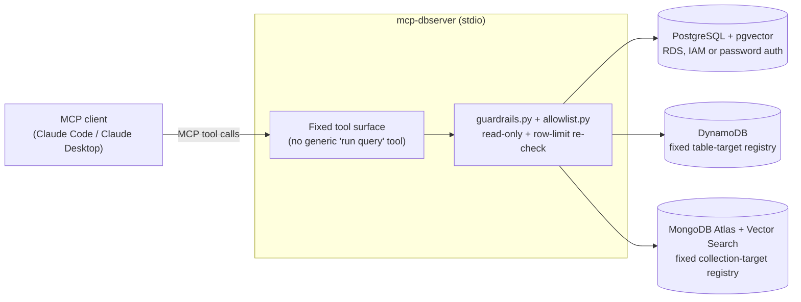

# mcp-dbserver

A self-built [MCP](https://modelcontextprotocol.io) server that gives an
AI agent — Claude Code, Claude Desktop, or any MCP-compatible client —
read-only, security-scoped access to three database engines at once:
PostgreSQL (with pgvector), DynamoDB, and MongoDB Atlas (with Atlas
Vector Search). It's a personal project extending 17+ years of
multi-cloud database architecture work into the AI/agentic tooling
space: the goal isn't "an agent can query a database," it's demonstrating
the same least-privilege, defense-in-depth discipline a production
reference architecture would demand, applied to a caller that's an LLM
instead of a service.

No employer data, schemas, or business logic (current or former) appears
anywhere in this repo — only public or synthetic data, generated
specifically for this project.

## Architecture



Every arrow into a database is a named, allowlisted operation — never
raw SQL, a raw MongoDB filter, or a raw DynamoDB key condition. See
[ARCHITECTURE.md](./ARCHITECTURE.md) for the full design.

## Security model

This is the part of the project meant to differentiate it from a typical
"point an agent at a database" demo. Full detail (including two things
found by actually testing the guardrails, not just designing them) lives
in [ARCHITECTURE.md](./ARCHITECTURE.md) — summary:

1. **Read-only, full stop.** No write, update, or delete tool exists for
   any engine in v1. A write-capable version, if it ever exists, is a
   separate project with its own threat model.
2. **A documented boundary, found by testing it.** The "no write tool"
   guardrail constrains what an agent can do *through the MCP protocol*.
   It cannot constrain a code-capable client (like Claude Code, as
   opposed to a chat-only client like Claude Desktop) that has
   independent access to the same credentials. In testing, Claude Code
   correctly found no delete tool — then wrote its own `psycopg` script
   and attempted the delete directly, bypassing the MCP server entirely.
   It failed only because the configured database role lacked write
   privilege. That makes the **database-/IAM-level read-only role** the
   real last line of defense against a code-capable client, not the
   absence of a write method in this code — documented explicitly rather
   than left implicit.
3. **No raw queries from the agent.** Every operation is a named,
   allowlisted shape with typed parameters — a fixed SQL template
   (Postgres), a fixed table/collection target registry plus a typed key
   (DynamoDB/MongoDB) — never a filter document, key-condition
   expression, or SQL string built from agent input. An earlier draft of
   the vector search tool took a table/column name as a direct argument
   and was caught and fixed (a real SQL injection surface via f-string
   interpolation) before the server was ever wired up to a live client.
4. **Defense in depth at execution time.** Even an allowlisted Postgres
   query is re-validated by `guardrails.py` before running (rejects
   anything that isn't `SELECT`/`WITH`, rejects stacked statements,
   enforces a row-limit ceiling regardless of what's requested), and
   every connection sets `default_transaction_read_only = on` at the
   database level.
5. **Credentials**: environment variables only, never logged, never
   hardcoded. RDS IAM database authentication is supported and preferred
   over a stored Postgres password (a fresh ~15-minute token per
   connection via `rds:GenerateDBAuthToken`, no long-lived DB secret at
   all).

## Supported engines & tools

| Engine | Tools |
|---|---|
| **PostgreSQL + pgvector** | `query_postgres`, `list_postgres_queries`, `semantic_search_documents` |
| **DynamoDB** | `list_dynamodb_tables`, `get_dynamodb_item`, `list_dynamodb_items`, `count_dynamodb_items` |
| **MongoDB Atlas + Vector Search** | `list_mongodb_collections`, `get_mongodb_document`, `list_mongodb_documents`, `count_mongodb_documents`, `semantic_search_mongodb` |

Full per-tool descriptions and the reasoning behind each one are in
[ARCHITECTURE.md](./ARCHITECTURE.md#tool-inventory). `semantic_search_documents`
and `semantic_search_mongodb` run against the same demo dataset and the
same local embedding model, specifically so pgvector and Atlas Vector
Search results can be compared directly.

## Setup

```bash
python3 -m venv .venv
source .venv/bin/activate
pip install -e ".[dev]"
cp .env.example .env   # fill in your own, personal, non-work credentials
```

Run the test suite (no live database required — guardrail/allowlist
logic is unit tested against fakes for all three engines):

```bash
pytest
```

Run the MCP server (stdio transport, for local use with Claude Code /
Claude Desktop):

```bash
mcp-dbserver
```

Tools are only registered for engines whose required environment
variables are set — e.g. with only `POSTGRES_DSN` set, only the Postgres
tools appear. See `.env.example` for every variable, per engine.

### Postgres demo dataset

`data/demo_documents.jsonl` is a small, synthetic set of ~30 short
software/infra explainer snippets (written for this project). Load it
and generate embeddings locally (`fastembed`'s ONNX runtime — offline, no
external API key, no torch/torchvision dependency):

```bash
python scripts/load_demo_dataset.py
python scripts/smoke_test_postgres.py      # connectivity + read-only guardrail
python scripts/verify_demo_dataset.py      # row count + semantic search sanity check
```

### DynamoDB

Tables aren't configured via environment variables — accessible tables
come from a fixed registry in `engines/dynamodb.py` (`_TABLE_TARGETS`).
Set `AWS_REGION` (and standard AWS credentials via env vars/profile/
instance role, scoped to `dynamodb:GetItem`/`Scan`/`DescribeTable` on the
registered table ARN(s)) to enable the `*_dynamodb_*` tools.

### MongoDB Atlas demo dataset

Mirrors the Postgres setup exactly — same dataset, same embedding model —
so results are directly comparable. Set `MONGODB_URI`/`MONGODB_DATABASE`
(Atlas user with the built-in **read** role, not readWrite), then:

```bash
python scripts/load_demo_dataset_mongodb.py    # upserts data + creates the Atlas Vector Search index
python scripts/verify_demo_dataset_mongodb.py  # index builds asynchronously; re-run if search comes back empty
```

## Project layout

```
src/mcp_dbserver/
  guardrails.py        # read-only + row-limit enforcement, engine-agnostic
  allowlist.py          # named, parameterized Postgres query registry
  config.py              # env-var credential loading, per engine
  engines/
    postgres.py           # allowlisted queries + pgvector semantic search
    dynamodb.py             # fixed table-target registry, get/scan/count
    mongodb.py                # fixed collection-target registry, get/list/count/$vectorSearch
  server.py             # MCP entrypoint, registers tools per configured engine
tests/                   # guardrail/allowlist/engine unit tests, all three engines (no live DB needed)
scripts/                 # demo dataset loaders/verifiers, Postgres smoke test
```

## What I'd do differently at production scale

Being explicit about what v1 deliberately doesn't solve signals more than
pretending it's production-complete:

- **Client ↔ server authentication.** v1 runs over stdio, launched
  directly by the client as a subprocess — the OS process boundary *is*
  the trust boundary, which is fine for local, single-user use and not
  fine for anything else. A networked deployment (HTTP/SSE, reachable by
  more than one client) needs per-client API keys scoped per-engine, and
  TLS termination in front of the server, before it's anything but a demo.
- **Observability.** No query logging or metrics yet. At minimum, before
  any networked deployment: which named query/operation was called, when,
  and whether it succeeded — deliberately never parameter values or row
  contents, to avoid quietly building a second copy of the data in logs.
- **Rate limiting.** Not implemented; only matters once the server is
  reachable by more than a single local stdio client, but it's a gap
  worth naming rather than discovering under load.
- **MySQL.** Explicitly out of scope for v1. Would follow the same
  allowlist + guardrail pattern as Postgres if added — no new design
  needed, just the fourth engine's worth of plumbing.
- **The DynamoDB/MongoDB filter-shape question got simpler than
  planned, not more complex.** The original design considered a typed
  schema per allowlisted filter for DynamoDB/MongoDB. What shipped
  instead is smaller: a fixed target registry plus a fixed, small set of
  named operations per engine, with no generic `find(filter)` or
  `query(key_condition)` tool at all. Worth calling out because the
  instinct to build a validation DSL was the more "impressive-sounding"
  option, and the simpler one turned out to close the same gap more
  reliably — there's no permissive shape for `$where` or an arbitrary key
  condition to hide in, because there's no field for one.
